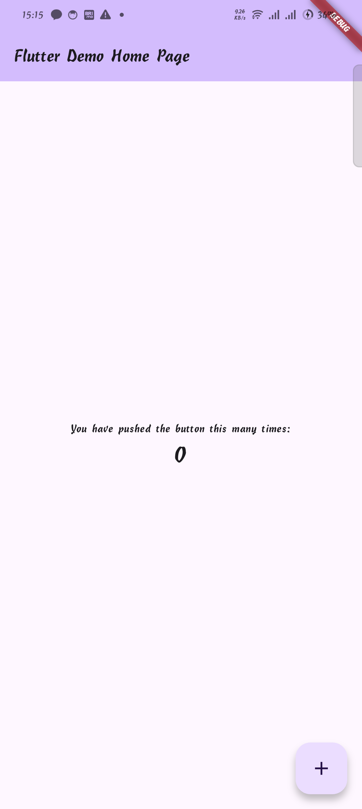

LAPORAN PRAKTIKUM – Tugas Praktikum
Pertemuan I – Instalasi
________________________________________
Nama : Muhamad Arifin
NIM : 230605110148
Kelas : i
________________________________________
Laporan
1.	Menjalankan Program
•	Jalankan aplikasi menggunakan kode program pada Sub Bab 3.
•	Pastikan aplikasi dapat berjalan tanpa error.

2.	Modifikasi Kode Program
•	Ubah teks pada AppBar menjadi “Program Pertamaku”.
•	Ganti teks “Hello World” dengan nama masing-masing.
•	Jalankan kembali program untuk melihat hasil perubahan.

 

3.	Pengujian pada Perangkat
•	Jalankan aplikasi pada emulator Android.
•	Uji aplikasi pada smartphone nyata melalui USB debugging.
•	Pastikan aplikasi dapat berjalan normal pada kedua perangkat.
 
 

4.	Pengamatan Waktu Eksekus
•	Catat waktu yang dibutuhkan aplikasi untuk pertama kali dijalankan hingga tampil di layar.
•	Bandingkan hasil waktu eksekusi antara emulator dan smartphone nyata.

External Debug = 8 detik ±

 

Emulator debug (Chrome) = 14,2 detik ±

 
